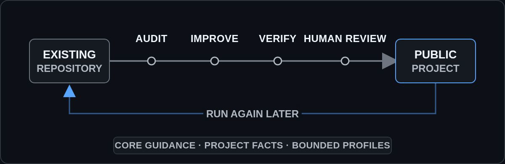

# OSS Agent Playbook

A technology-neutral maintenance playbook for applying recurring open-source work to
existing repositories. It helps file-aware agents audit public readiness, make authorized
improvements, verify observable results, and hand a concrete candidate to a human for
acceptance without recopying the same guidance into every project.

<p align="center">
  <a href="https://github.com/segfault-stack/oss-agent-playbook/actions/workflows/docs.yml"></a>
  <a href="https://github.com/segfault-stack/oss-agent-playbook/releases/latest"></a>
  <a href="LICENSE"></a>
</p>

<p align="center">
  <a href="#why-this-exists">Why</a> ·
  <a href="#how-a-playbook-run-works">How it works</a> ·
  <a href="#try-it-or-keep-it-available">Try it</a> ·
  <a href="ADOPTION.md">Adoption</a> ·
  <a href="#contributing-and-support">Contributing</a>
</p>

<p align="center">
  
</p>

**Status:** pre-1.0, evolving experiment and reference implementation. It has not been
validated as a universal standard. Pin an exact release or commit when adopting it;
before `1.0.0`, minor releases may revise guidance or integration files incompatibly.

## Why this exists

Preparing different existing projects for public open-source life repeatedly raises the
same questions: what is safe to expose, what the project can honestly claim, how a stranger
can evaluate it, which checks support those claims, and who may merge, release, or
communicate publicly. Project facts and technology details differ, but re-explaining or
copying the recurring maintenance rules for every agent and repository wastes work and
causes drift.

This playbook provides a reusable baseline while keeping local facts and bounded
technology-specific guidance separate. It can support a one-time audit or remain available
for later passes as the repository, its releases, and the shared guidance change.

## How a playbook run works

A run may stop after a read-only audit; it does not have to edit or publish anything.
Keeping the playbook connected makes repeated use easier, but the repository provides
guidance and deterministic documentation checks, not an always-on linter, updater,
sandbox, or policy engine.

Agents may research, edit, verify, and perform explicitly authorized mechanical actions.
Passing checks provide evidence, but a human maintainer still decides whether the exact
change is accepted into the public project.

## How the guidance stays disciplined

- The reusable core owns technology-neutral OSS properties and workflow. Project-local
  context owns verified commands, risks, publication boundaries, and deliberate choices.
- Optional profiles specialize named artifacts or interfaces. A project selects them;
  applicable repository signals or an explicit task introduction, together with current
  task scope, activate them. Their outcomes must be observable, and a technology mention
  alone does not apply an available profile.
- The workflow keeps agent capability, task authorization, verification evidence,
  concrete-candidate review, and maintainer acceptance distinct. Runtime and platform
  controls remain outside the Markdown playbook.
- Rules have a primary owner. Deterministic checks validate only properties they can
  observe rather than standing in for judgment.

This repository uses the same separation in its own maintenance: `AGENTS.md` routes work,
`PROJECT_AGENT_CONTEXT.md` records current local facts, `MAINTAINER_MEMORY.md` holds
reviewed advisory lessons, and `docs/decisions/` preserves consequential history. That
separation demonstrates the model; consumer requirements come from the adoption documents
and templates, not from copying this repository's exact maintenance layout.

## What it covers

- read-only audit and risk-based prioritization;
- repository positioning, metadata, README authoring, and public surfaces;
- secrets, privacy, licensing, dependencies, and reproducibility;
- proportional quality gates, CI, branch policy, releases, and operations;
- authorization boundaries for pushes, releases, deployments, and external communication;
- adoption templates and optional, project-selected technology profiles.

The core does not replace legal advice, choose a consumer project's license or technology
stack, deeply validate a technology without an applicable profile, create support promises,
or authorize external actions.

## Try it or keep it available

### Try a read-only audit

From the directory containing the target repository, clone a tagged playbook release
beside it. Resolve the tag to a specific commit and record that commit as the immutable
reference:

```bash
git clone \
  --branch v0.6.0 \
  https://github.com/segfault-stack/oss-agent-playbook.git \
  oss-agent-playbook
```

Then give a file-aware agent both local paths and a bounded task:

```text
Using <PLAYBOOK_PATH>/docs/agent-workflow.md, audit <TARGET_REPOSITORY_PATH> without changing
files. Report the three highest-priority findings with evidence, important uncertainties,
and the checks that would verify any proposed change.
```

This adds nothing to the target repository and authorizes no edit, push, release, message,
or repository-setting change.

### Keep it available for repeated use

For later audits and improvement passes, keep a playbook revision pinned to a resolved
commit visible to the repository and route agents to it. The supported delivery choices are a squashed Git
subtree (the public default), a Git submodule, or a reviewed vendored snapshot. Each has
different checkout and provenance tradeoffs; none updates automatically.

Follow the [adoption guide](ADOPTION.md) for commands, project-context templates, profile
selection, updates, verification, and rollback. Merge its routing templates into existing
instructions rather than overwriting project-specific guidance.

After setup, verify the imported playbook:

```bash
test -f .agent/oss-playbook/README.md
python3 .agent/oss-playbook/scripts/check_docs.py
```

Success prints `Documentation checks passed` with the number of Markdown files in that
pinned revision. Consumer repositories must separately run the checks that cover their own
code, behavior, and enabled profiles.

## Playbook map

- [Adoption](ADOPTION.md) — one-off use, connected delivery, routing, updates, and rollback.
- [Principles](docs/principles.md) — scope, positioning, evidence, and restraint.
- [Audit and priorities](docs/audit-and-priorities.md) — how to inspect a repository and order work.
- [Public interface](docs/public-interface.md) — metadata, documentation, and community surfaces.
- [README authoring](docs/readme-authoring.md) — reader journey, quick start, and claims.
- [README presentation](docs/readme-presentation.md) — prose, tables, visuals, badges, and rendering.
- [Security and reproducibility](docs/security-and-reproducibility.md) — secrets, privacy, dependencies, builds, and supply chain.
- [Engineering and releases](docs/engineering-and-releases.md) — quality gates, CI, branches, operations, and releases.
- [Agent workflow](docs/agent-workflow.md) — authorization, execution, verification, review, and handoff.
- [Checklists](docs/checklists.md) — publication and maintenance review.
- [Technology profiles](profiles/README.md) — project-selected, task-activated technology overlays.

## Contributing and support

Issues and pull requests are welcome when they make agent decisions clearer or safer. Read
[Contributing](CONTRIBUTING.md), [Governance](GOVERNANCE.md), and
[AI-assisted contributions](AI_CONTRIBUTIONS.md) before proposing a change. Use
[Support](SUPPORT.md) to choose the right help channel and [Security](SECURITY.md) for
sensitive reports.

Run the dependency-free documentation check locally:

```bash
python3 scripts/check_docs.py
```

## Versioning

Tags use semantic versioning. Before `1.0.0`, minor releases may contain breaking guidance
or integration changes. After `1.0.0`, moving or renaming a routed document, changing
adapter behavior, or materially reversing a normative default requires a major release.
Consumer repositories should review updates like dependency changes instead of tracking a
mutable branch.

## License

The playbook, templates, profiles, and supporting scripts are dedicated to the public
domain under [CC0 1.0 Universal](LICENSE). They may be copied, modified, and redistributed
without attribution to the extent allowed by law.
